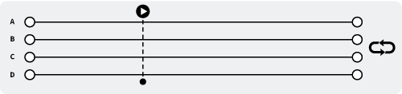

# Audio-Sync
An engine for playing multiple audio files at the same time, toggling volume states to cross-fade and only have one audible at a time. Syncing their playback.

### Representation

****

The does not represent appication UI. The code as it stands is driven by events, and has sample buttons, but the engine itself has no UI (it's an NSObject Class).

### Current Base State

Four looping tracks start playting with a start sync. It is assumed after start that the tracks will remain in sync. There is no mechanism to check to make sure after starting. At any given time, one track may be audible. If another track is chosen to play, the currently playing track will fade out while the selected track fades in. Using AVAudioPlayerNodes, so the can be positioned in 3D space to some degree.
